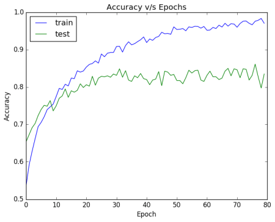
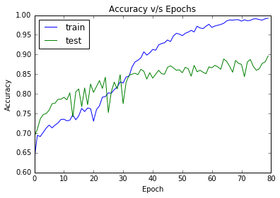
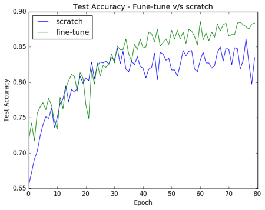
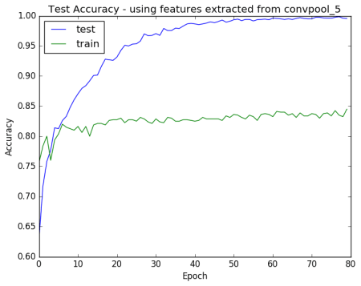

# My experiments with AlexNet, using Keras and Theano
A blog post accompanying this project can be found [here](https://rahulduggal2608.wordpress.com/2017/04/02/alexnet-in-keras/).

## Contents
1. [Motivation](#motivation)
2. [Requirements](#requirements)
3. [Experiments](#experiments)
4. [Results](#results)
5. [TO-DO](#to-do)
8. [License](#license)

## Motivation
When I first started exploring deep learning (DL) in July 2016, many of the papers I read established their baseline performance using the standard AlexNet model. In part, this could be attributed to the several code examples readily available across all major Deep Learning libraries. Despite its significance, I could not find readily available code examples for training AlexNet in the Keras framework. Through this project, I am sharing my experience of training AlexNet in three very useful scenarios :-

1. **Training AlexNet end-to-end** - Also known as training from scratch
2. **Fine-Tuning the pre-trained AlexNet** - extendable to transfer learning
3. **Using AlexNet as a feature extractor** - useful for training a classifier such as SVM on top of "Deep" CNN features.

I have re-used code from a lot of online resources, the two most significant ones being :-
1. [This](https://blog.keras.io/building-powerful-image-classification-models-using-very-little-data.html) blogpost by the creator of keras - Francois Chollet.
2. [This](https://github.com/heuritech/convnets-keras) project by Heuritech, which has implemented the AlexNet architecture.

## Requirements
This project is compatible with **Python 2.7-3.5**
Make sure you have the following libraries installed.
1. [Keras](https://keras.io) - A high level neural network library written in python. To install, follow the instructions available [here](https://keras.io/#installation).
2. [Theano](http://deeplearning.net/software/theano/introduction.html) - A python library to efficiently evaluate/optimize mathematical expressions. To install, follow the instructions available [here](http://deeplearning.net/software/theano/install.html).
3. [Anaconda](https://docs.continuum.io/) - A package of python libraries which includes several that are absolutely useful for Machine Learning/Data Science. To install, follow the instructions available [here](https://docs.continuum.io/anaconda/install). 

**Note :** If you have a GPU in your machine, you might want to configure Keras and Theano to utilize its resources. For myself, running the code on a K20 GPU resulted in a 10-12x speedup.


## Experiments
- To perform the three tasks outlined in the motivation, first we need to get the dataset. We run our experiments on the dogs v/s cats training dataset available [here](https://www.kaggle.com/c/dogs-vs-cats/data).
- We use 1000 images from each class for training and evaluate on 400 images from each class. Ensure that the images are placed as in the following directory structure.
```python
Data/
    Train/
         cats/
            cat.0.jpg
            cat.1.jpg
            .
            .
            .
            cat.999.jpg
         dogs/
            dog.0.jpg
            dog.1.jpg
            .
            .
            .
            dog.999.jpg
     Test/
         cats/
            cat.0.jpg
            cat.1.jpg
            .
            .
            .
            cat.399.jpg
         dogs/
            dog.0.jpg
            dog.1.jpg
            .
            .
            .
            dog.399.jpg
```
- Download the pre-trained weights for alexnet from [here](http://files.heuritech.com/weights/alexnet_weights.h5) and place them in ```convnets-keras/weights/```.
- Once the dataset and weights are in order, navigate to the project root directory, and run the command ```jupyter notebook``` on your shell. This will open a new tab in your browser. Navigate to ```Code/``` and open the file ```AlexNet_Experiments.ipynb```.
- Now you can execute each code cell using ```Shift+Enter``` to generate its output.

## Results
**Task 1 : Training from scratch**
1. Training AlexNet, using stochastic gradient descent with a fixed learning rate of 0.01, for 80 epochs, we acheive a test accuracy of ~84.5%.
2. In accuracy plot shown below, notice the large gap between the training and testing curves. This suggests that our model is overfitting. This is usually a problem when we have few training examples (~2000 in our case). However, this problem can be partially addressed through finetuning a pre-trained network as we will see in the next subsection.
<p align="center">
  
</p>

**Task 2 : Fine tuning a pre-trained AlexNet**
1. CNN's trained on small datasets usually suffer from the problem of overfitting. One of the solutions is to initialize your CNN with weights learnt on a very large dataset and then finetuning the weights on your dataset.  
2. Several papers talk about different strategies for fine-tuning. In this project, I execute the strategy proposed in [this](http://ieeexplore.ieee.org/abstract/document/7426826/) recent paper. The basic strategy is to train layer-wise. So if our network has 5 layers : L1,L2,...,L5. In the first round, we freeze L1-L4 and tune only L5. In the second round, we include L4 in the training. So L4-L5 are allowed to tune for some epochs. The third round includes L3 in the training. So now L3-L5 are tuned. Similarly the training percolates to previous layers. 
2. Training for 80 epochs, using the above strategy, we reach a test accuracy of ~89%. This is almost a 5% jump over training from scratch. The test error plot is shown below.
<p align="center">
  
</p>

3. To compare fine-tuning v/s training from scratch, we plot the test accuracies for fine-tuning (Task 2) v/s training from scratch (Task 1) below. Notice how much the accuracy curve for fine-tuning stays above the plot for task 1.
<p align="center">
  
</p>

**Task 3 : Using AlexNet as a feature extractor**
1. We train a small ANN consisting of 256 neurons on the features extracted from the last convolutional layer. After training for 80 epochs, we got a test accuracy of ~83%. This is almost as much as the accuracy of AlexNet trained from scratch.
2. The test accuracy plot shown below reveals massive overfitting as was the case in Task-1.
<p align="center">
  
</p>

## TO-DO
1. The mean subtraction layer (look inside Code/alexnet_base.py) currently uses a theano function - set_subtensor. This introduces a dependancy to install Theano. I would ideally like to use a keras wrapper function which works for both Theano and Tensorflow backends. I'm not sure if such a wrapper exists though. Any suggestions for the corresponding Tensorflow function, so that I could write the Keras wrapper myself?
2. Use this code to demonstrate performance on a dataset that is significantly different from ImageNet. Maybe a medical imaging dataset?

## License
This code is released under the MIT License (refer to the LICENSE file for details).


